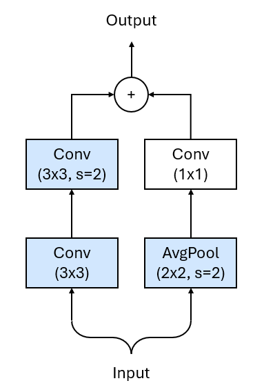

# ResNet18-2Plus1DD
<div style="display: flex; gap: 10px; flex-wrap: wrap; margin-bottom: 10px;">
    
    
    
    
</div>
<br/>

A fully serializable 2Plus1D(3D) implementation of ResNet18, incorporating improvements from the paper ["Bag of Tricks for Image Classification with Convolutional Neural Networks"](https://arxiv.org/abs/1812.01187) along with additional personal optimizations and modifications.

2Plus1D processes spatial and temporal dimensions separately using two consecutive convolutional layers, which are then concatenated. This method enables efficient handling of high-dimensional data while keeping computational costs relatively low. It was introduced in ["A Closer Look at Spatiotemporal Convolutions for Action Recognition"](https://arxiv.org/abs/1711.11248v3).

**When to Use 2+1D Convolutions?**

They excel in video analysis (action recognition, motion detection) where spatial and temporal features are naturally separable. For comparison:

- 3D Convolutions: Better for dense spatiotemporal correlations (e.g., fluid dynamics).

- 2+1D Convolutions: Optimal for balancing efficiency and performance in most video tasks.

This repository also includes implementations of the Hardswish and Mish activation functions:

- [Searching for MobileNetV3](https://arxiv.org/abs/1905.02244)
- [Mish: A Self Regularized Non-Monotonic Neural Activation Function](https://arxiv.org/abs/1908.08681)

The codebase is fully integratable inside the TensorFlow and Keras code pipelines.

## Key Enhancements
- **Modified Stem:** Utilizes three convolutional layers instead of a single one.
- **ResNet-B Inspired Strides:** Moved the stride placement in the residual blocks from the first convolution to the second.
- **ResNet-D Inspired Shortcut:** Introduces an average pooling layer before the 1x1 convolution in the shortcut connection.
- **Reduced Downsampling:** The temporal dimension is now downsampled only twice in the stem block, while the spatial dimension follows the original approach, undergoing downsampling five times.

<br/>
<br/>
<div align="center" style="display: flex; justify-content: center; align-items: center;">
    
    
</div>
<br/>

*Note: The images above represent the architectural modifications. They depict 2D convolutional layers, whereas this project is focused on 2Plus1D(3D) convolutions. The ResNet-C image is sourced from the referenced paper, while the shortcut image is created by the author.*

## Installation & Usage
This code is compatible with **Python 3.12.8** and **TensorFlow 2.18.0**.

```python
from ResNet182Plus1DD import ResNet182Plus1DD


model = ResNet182Plus1DD()
model.build((None, 32, 256, 256, 3))
model.summary()
```

### Model Summary Example
```bash
Model: "res_net182_plus1dd"
┏━━━━━━━━━━━━━━━━━━━━━━━━━━━━━━━━━━━━━━┳━━━━━━━━━━━━━━━━━━━━━━━━━━━━━┳━━━━━━━━━━━━━━━━━┓
┃ Layer (type)                         ┃ Output Shape                ┃         Param # ┃
┡━━━━━━━━━━━━━━━━━━━━━━━━━━━━━━━━━━━━━━╇━━━━━━━━━━━━━━━━━━━━━━━━━━━━━╇━━━━━━━━━━━━━━━━━┩
│ conv2_plus1d_layer                   │ (None, 16, 128, 128, 32)    │           2,706 │
│ (Conv2Plus1DLayer)                   │                             │                 │
├──────────────────────────────────────┼─────────────────────────────┼─────────────────┤
│ conv2_plus1d_layer_1                 │ (None, 16, 128, 128, 32)    │          27,648 │
│ (Conv2Plus1DLayer)                   │                             │                 │
├──────────────────────────────────────┼─────────────────────────────┼─────────────────┤
│ conv2_plus1d_layer_2                 │ (None, 16, 128, 128, 64)    │          55,680 │
│ (Conv2Plus1DLayer)                   │                             │                 │
├──────────────────────────────────────┼─────────────────────────────┼─────────────────┤
│ max_pooling3d (MaxPooling3D)         │ (None, 8, 64, 64, 64)       │               0 │
├──────────────────────────────────────┼─────────────────────────────┼─────────────────┤
│ residual2_plus1dd (Residual2Plus1DD) │ (None, 8, 64, 64, 64)       │         221,184 │
├──────────────────────────────────────┼─────────────────────────────┼─────────────────┤
│ residual2_plus1dd_1                  │ (None, 8, 32, 32, 128)      │         672,384 │
│ (Residual2Plus1DD)                   │                             │                 │
├──────────────────────────────────────┼─────────────────────────────┼─────────────────┤
│ residual2_plus1dd_2                  │ (None, 8, 32, 32, 128)      │         884,736 │
│ (Residual2Plus1DD)                   │                             │                 │
├──────────────────────────────────────┼─────────────────────────────┼─────────────────┤
│ residual2_plus1dd_3                  │ (None, 8, 16, 32, 256)      │       2,687,616 │
│ (Residual2Plus1DD)                   │                             │                 │
├──────────────────────────────────────┼─────────────────────────────┼─────────────────┤
│ residual2_plus1dd_4                  │ (None, 8, 16, 32, 256)      │       3,538,944 │
│ (Residual2Plus1DD)                   │                             │                 │
├──────────────────────────────────────┼─────────────────────────────┼─────────────────┤
│ residual2_plus1dd_5                  │ (None, 8, 8, 16, 512)       │      10,749,696 │
│ (Residual2Plus1DD)                   │                             │                 │
├──────────────────────────────────────┼─────────────────────────────┼─────────────────┤
│ residual2_plus1dd_6                  │ (None, 8, 8, 16, 512)       │      14,155,776 │
│ (Residual2Plus1DD)                   │                             │                 │
├──────────────────────────────────────┼─────────────────────────────┼─────────────────┤
│ global_average_pooling3d             │ (None, 512)                 │               0 │
│ (GlobalAveragePooling3D)             │                             │                 │
├──────────────────────────────────────┼─────────────────────────────┼─────────────────┤
│ dense (Dense)                        │ (None, 256)                 │         131,328 │
└──────────────────────────────────────┴─────────────────────────────┴─────────────────┘
 Total params: 33,127,698 (126.37 MB)
 Trainable params: 33,127,698 (126.37 MB)
 Non-trainable params: 0 (0.00 B)
```

## License
This work is under an [MIT](https://choosealicense.com/licenses/mit/) License.